--------------------------------------------
### App Name: Communication Station Golang Microservices
* Built Full stack of Communication Station GO application with all independent services including Broker, Listener, Authentication, Logging, and Mailing which can communicate in different methods (REST API – JSON, RPC, gRPC), store data in different usage (RabbitMQ, Mongo, Postgres), and scale themselves by containerizing in automating deployments (Docker, Docker Swarm, Kubernetes). 
--------------------------------------------
##  Architecture - 7 folders:
1. project folder: configuration and environment for Docker, Docker Swarm, Kubernetes, Caddy, NGINX, RabbitMQ, PostgreSQL, and MongoDB.
2. broker-service folder
3. authentication-service folder
4. logger-service folder
5. listener-service folder
6. mail-service folder
7. front-end
  
--------------------------------------------
## Functionality – six services:
1. A Front End service: displays web pages
2. A Broker service: an optional single point of entry into the microservice cluster
3. An Authentication service: with a Postgres database
4. A Logging service: with a MongoDB database
5. A Listener service: receives messages from RabbitMQ and acts upon them
6. A Mail service: takes a JSON payload, converts into a formatted email, and send it out
--------------------------------------------
## Deployments:
1. Docker Swarm: 2 Nodes (1 manager, 1 worker) with security configuration.
2. Kubernetes: 9 deployments, 9 services, and Ingresses (NGINX)
--------------------------------------------
## Configuration:
  
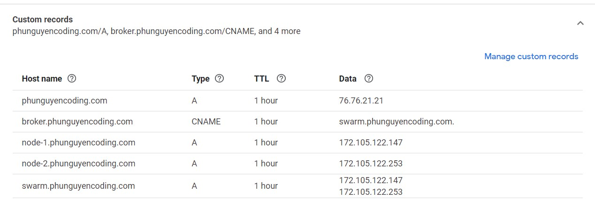  

--------------------------------------------

## Demo
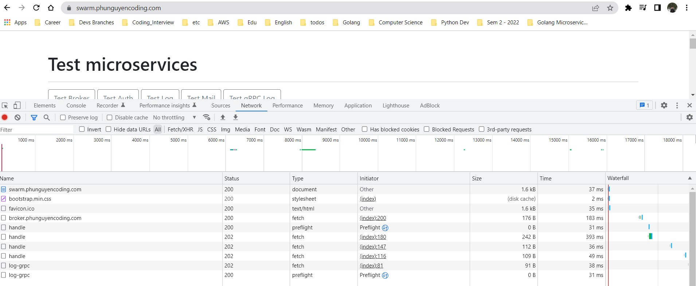  
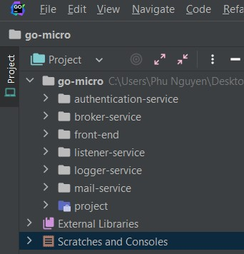  
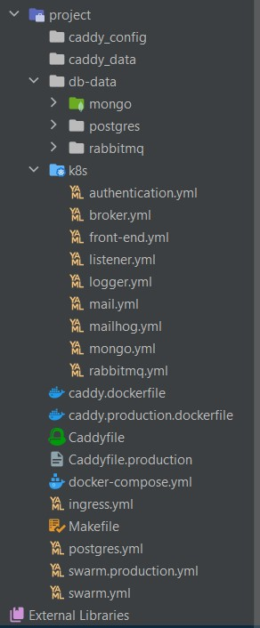  
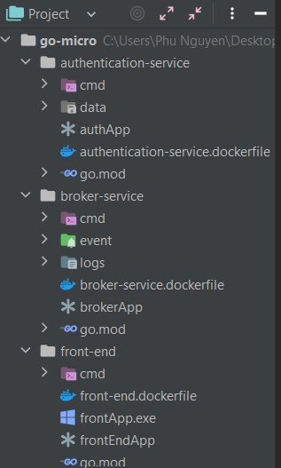  
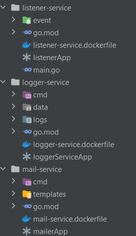  
### Docker Swarm
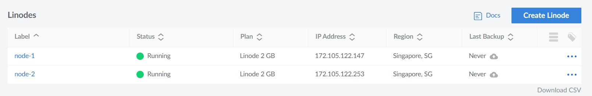  
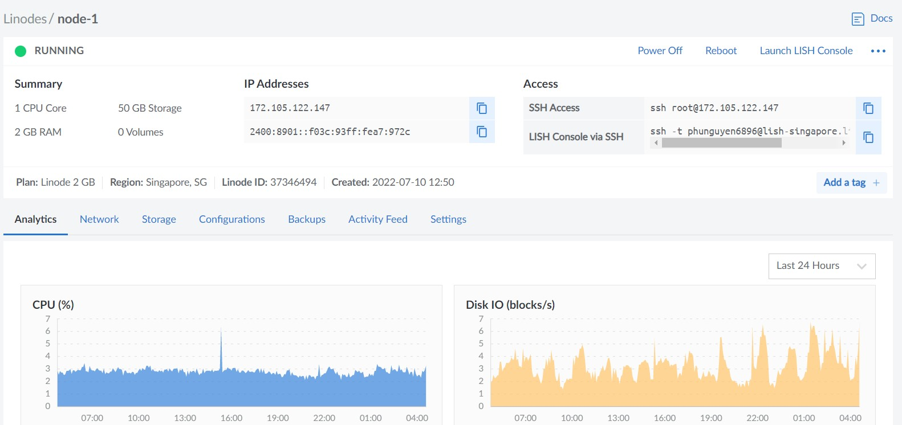  
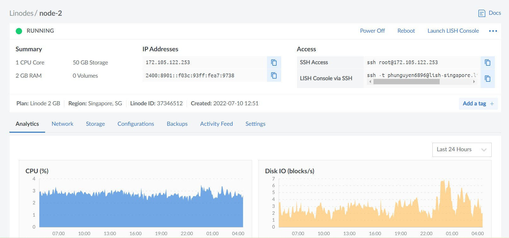  
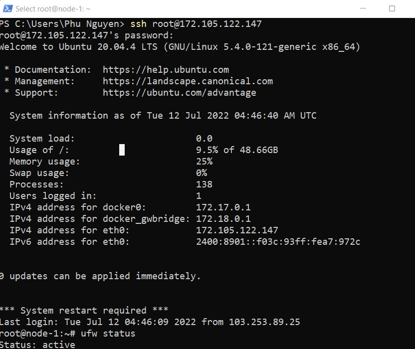  
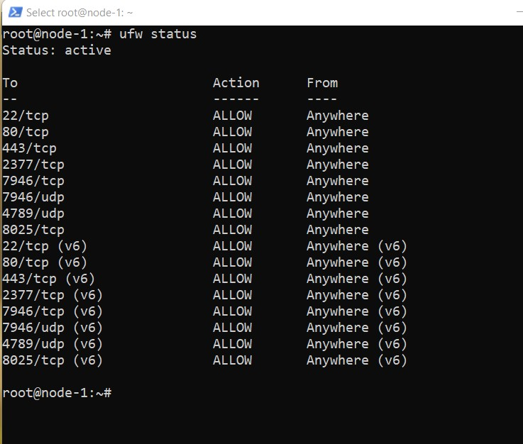  
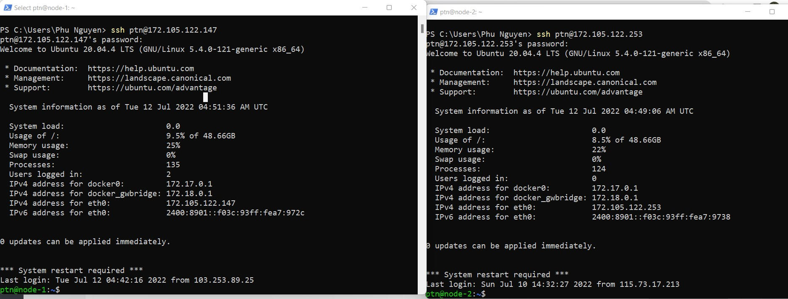  
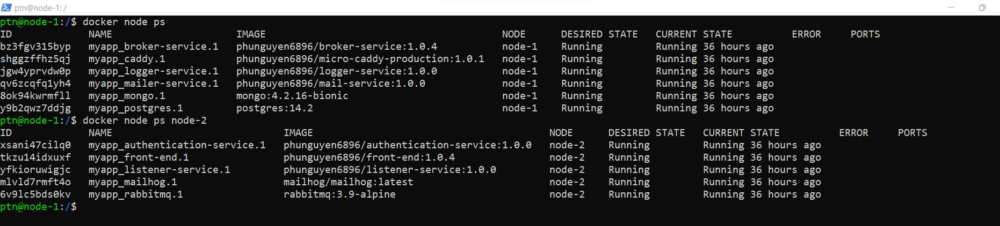  
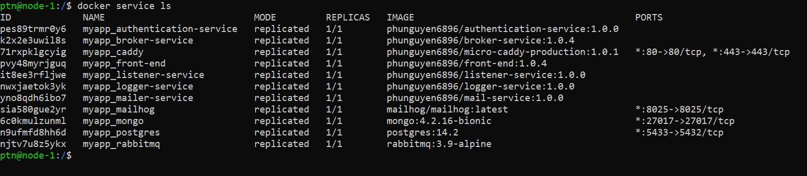  
### Kubernetes
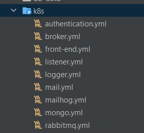  
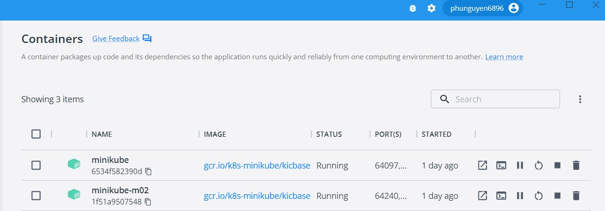  
  
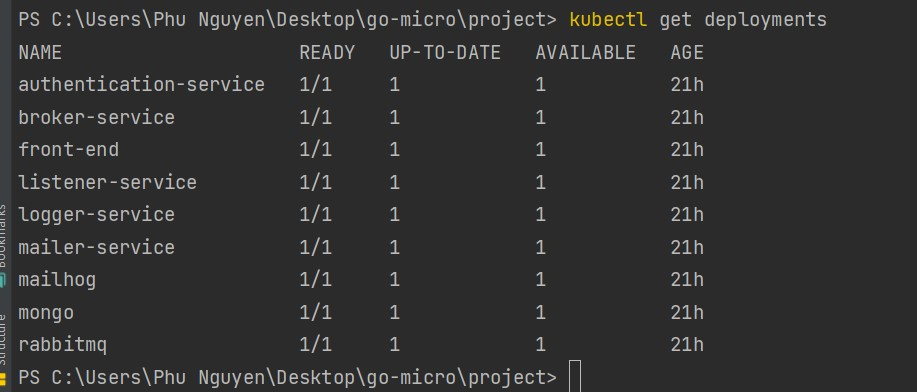  
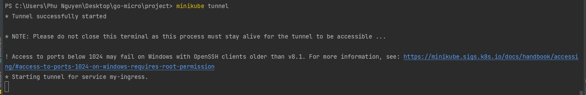  
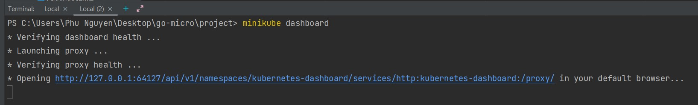  
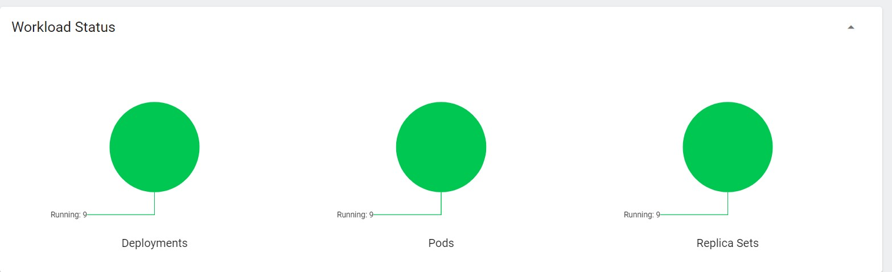  
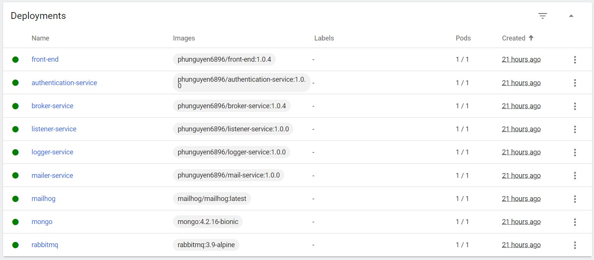  
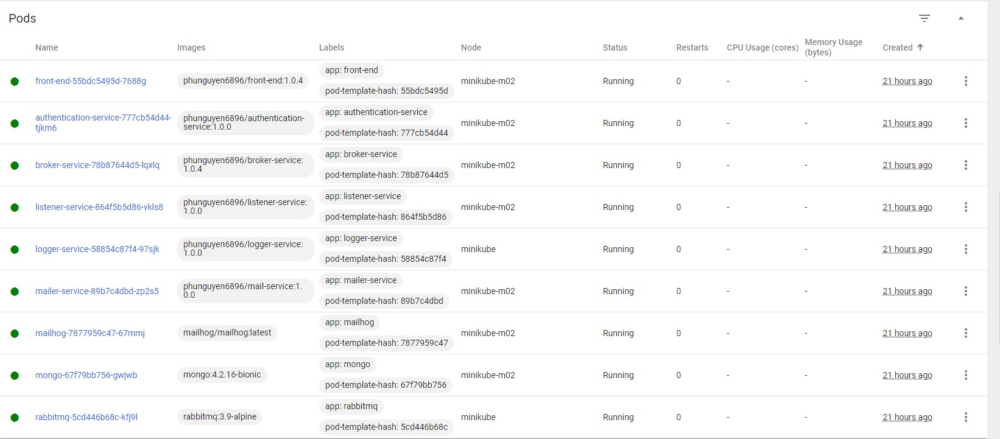  
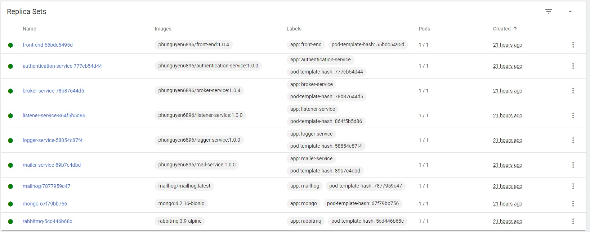  
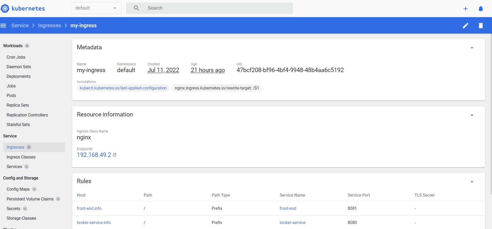  
